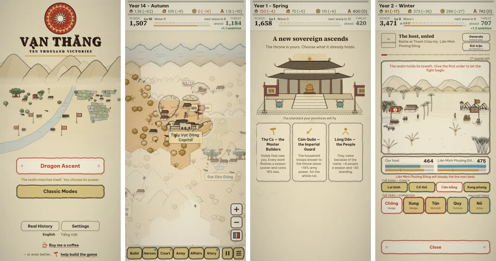
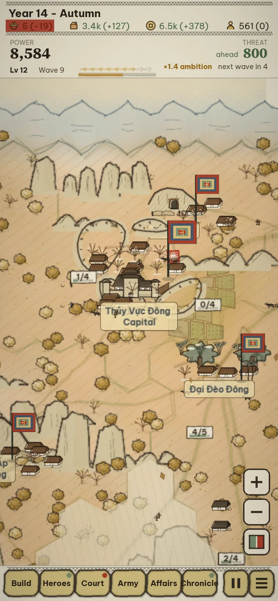
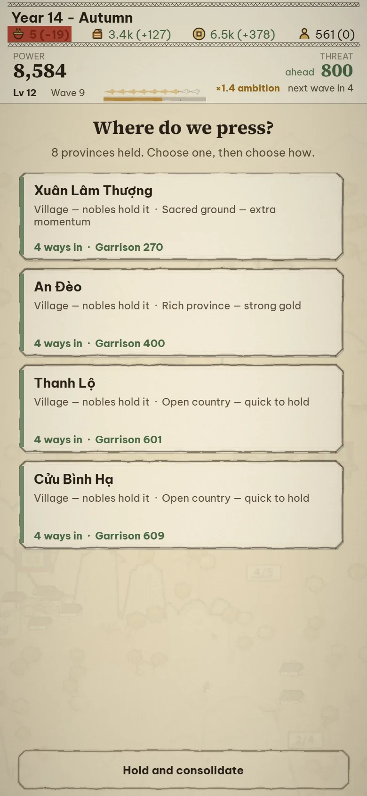
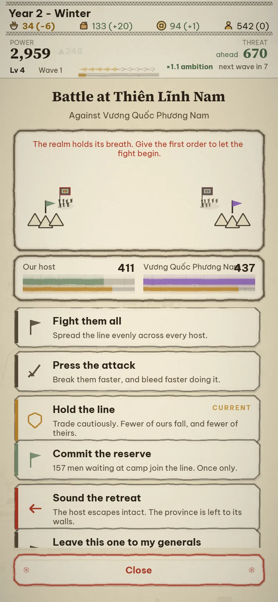
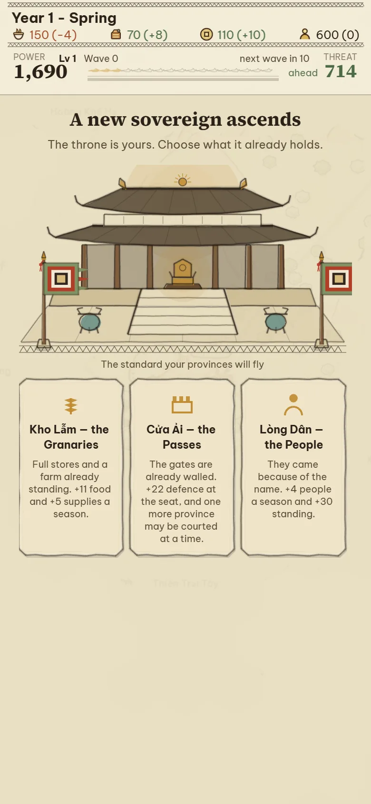
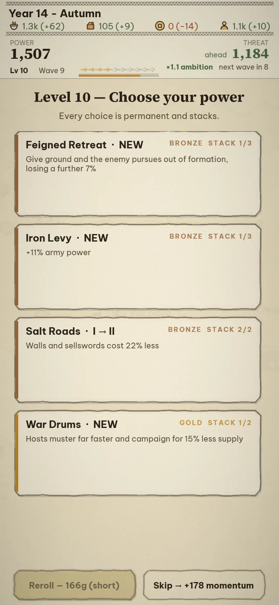
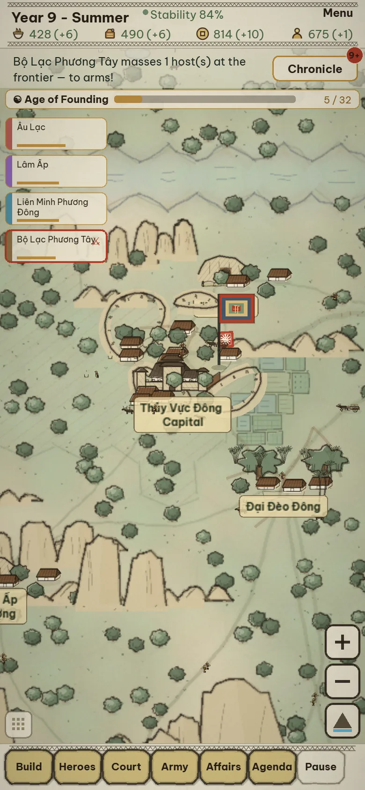
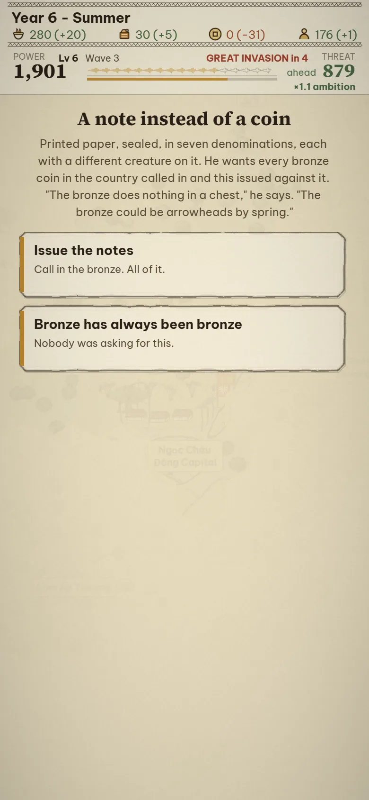
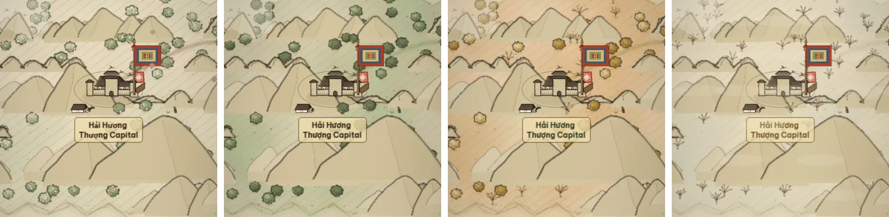
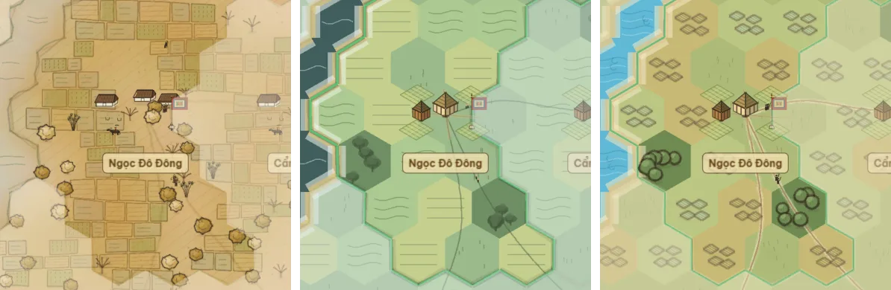

<div align="center">



# Mandate of Đại Việt

### Vietnamese history, played one-handed on a phone.

**A grand-strategy game printed like a Đông Hồ woodblock — free, ad-free, in English and Tiếng Việt.**

[](https://zrg-team.github.io/Throne-of-Dai-Viet/)
&nbsp;
[](https://github.com/zrg-team/Throne-of-Dai-Viet/actions/workflows/deploy-github-pages.yml)


</div>

---

## 🎯 Why this exists

Every Vietnamese child grows up with the same stories: the boy who played war with reed banners and became an emperor; the divine crossbow and the goose feathers that betrayed it; the stakes hidden in the Bạch Đằng river; the elders at Diên Hồng who answered *fight*; the boy who crushed an orange in his fist because he was too young to be let into the council.

Outside Việt Nam almost nobody knows them. Inside, they arrive as paragraphs in a textbook.

**Mandate of Đại Việt** is an attempt to make that history *playable* — to have Yết Kiêu the diver, Lê Lai's borrowed coat and the Temple of Literature turn up as decisions on your screen, in a game good enough that people play it for the game. It is written for the phone in your pocket, in both languages as equals, and it is free.

## 🐉 How it plays

You are a small lord with one citadel on a map of forty-two provinces, generated fresh for every run. The map is the whole progression tree: a paddy province solves food, an iron mountain hardens your infantry, a port pays for expansion, a temple steadies your court, and a rival's walls are the problem you are building towards. Time is real-time — the realm ticks whether you are watching or not — and every choice is a card you can answer with a thumb.

<table>
  <tr>
    <td align="center" width="33%"><br><sub>The realm, mid-run</sub></td>
    <td align="center" width="33%"><br><sub>Where do we press?</sub></td>
    <td align="center" width="33%"><br><sub>A battle you can command — or leave to your generals</sub></td>
  </tr>
</table>

### 🔥 Dragon Ascent · *Rồng Thăng Long*

The headline mode, and a roguelite: **the realm marches itself; you choose its power.**

- **Waves.** Every year and a half an invading host arrives, bigger than the last; every fourth is a boss, telegraphed a season ahead. Survive as many as you can — there is no win, only how far you got.
- **Ambition is the dial.** Every province you take, every card you draft, every host you raise, raises the heat of what comes back at you. Expansion is never free.
- **Power draft.** Level up and choose one of four cards — bronze, silver, gold, jade — that stack permanently. Two cards you have maxed can *evolve* into something neither was.
- **Champions.** Summon heroes from a gacha with pity, or draft them from your court's Favor. Each has six stats, a portrait, and a name that might be real.
- **Doctrine.** Once an era, tell your ministers what kind of realm this is — *Fortify, Expand, Enrich, Arm* — and the autopilot builds towards it until you say otherwise.
- **Battles.** A fight worth watching opens itself. Set the posture, pick a focus, commit the reserve, rally, retreat — or *leave this one to my generals*.
- **The end of a run banks Legacy**, which buys permanent perks for the next.

### 👑 Throne of Empires · *Ngai Vàng Các Đế Quốc*

Endless survival on the hand-played map. Four empires press from *off* the map; you climb through eras — Founding, Rivalry, Empires, Mandate — with directives to fulfil, edicts and wonders to build, crises to weather, and a court of heroes with missions and abilities. The only victory is to *ascend*.

### ⚔️ Campaign

The classic: expand province by province against three rival kingdoms on the same map, and take their capitals.

<table>
  <tr>
    <td align="center" width="33%"><br><sub>Found your dynasty</sub></td>
    <td align="center" width="33%"><br><sub>Choose your power</sub></td>
    <td align="center" width="33%"><br><sub>Throne of Empires</sub></td>
  </tr>
</table>

### 🌾 The economy underneath

Four resources — **food, supplies, gold, humans** — flow from provinces whose yields come from their actual hexes: paddies and rivers feed, hills and mountains arm, ports trade. Seasons move the harvest (autumn ×1.25, winter ×0.8). Armies eat rations and burn provisions on the march and desert when they starve; heroes draw pay; income past five hundred gold is taxed by diminishing returns and a hoard past four thousand starts leaking to graft. Every number the interface quotes — the odds on a battle card, the demand on a province — is computed by the same code that will resolve it.

## 📜 The Chronicle

The stories are not cutscenes. They are **forty-eight templates** that bind themselves to *your* heroes and *your* provinces when the moment fits — a whisper on the map, a card in your hand, or a blow that changes the run — and each one is a piece of Vietnamese history or legend, told at the length a run has room for.

<table>
  <tr>
    <td width="40%"></td>
    <td valign="top">

**A few of the pages**

- *Ngọn Cờ Lau* · The Reed Banner — Đinh Bộ Lĩnh
- *Nỏ Thần* · The Divine Crossbow — and *Lông Ngỗng*, the goose feathers
- *Cọc Bạch Đằng* · The Stakes in the River
- *Hội Nghị Diên Hồng* · The Elders Answer
- *Quả Cam* · The Orange — Trần Quốc Toản
- *Hịch Tướng Sĩ* · Proclamation to the Officers
- *Nam Quốc Sơn Hà* · The Mountains and Rivers of the Southern Land
- *Chiếu Dời Đô* · The Edict on Moving the Capital
- *Bình Ngô Đại Cáo* · The Great Proclamation
- *Hai Bà Trưng* · The Trưng Sisters, and *Sáu Mươi Lăm Thành*
- *Lê Lai Đổi Áo* · The Substitution
- *Hồ Gươm* · The Lake of the Returned Sword
- *Yết Kiêu* · The Diver · *Ải Chi Lăng* · *Thần Tốc* · *Văn Miếu* · *Lũy Thầy* · *Đê Điều* · *Thánh Gióng* · *Sơn Tinh Thủy Tinh* …

Some stories ask you to **swear a charge** — hold a province, keep the peace, build what you promised — and remember whether you kept it. Some leave **echoes** in the browser, so a hero who walked out on you in one run can be named in the next. All of it lands in a Chronicle you can read back at the end.

</td>
  </tr>
</table>

## 🖌️ The look

The whole game is drawn like a **Đông Hồ folk woodblock print**: shell-coated điệp paper, a colour block pulled first and a soot-black contour pulled second, never quite in register. There are almost no sprites — the paddies, banyans, buffalo, citadels, hosts and portraits are procedural drawing, in a palette of real pigments (điệp, mực, sỏi son, chàm, gỉ đồng, hoè, nâu). The saturated red is spent on the player alone.

The country turns with the calendar. Nothing is a colour filter over the screen — the leaves change, the paddies flood, ripen and are cut, the winter is bare:



Two other art directions ship in Settings — an ink-wash and an illustrated atlas — but Đông Hồ is the game:



Portraits are composed from a library of seventy-four drawn parts — collars, hats, hair, marks — chosen by **who the person is** (era, office, rank, sex, vows) before a seed picks within that wardrobe, so an official of the Lê court does not wear a Nguyễn collar and a general in the field does not wear a scholar's cap.

## 📱 Play

**[▶ zrg-team.github.io/Throne-of-Dai-Viet](https://zrg-team.github.io/Throne-of-Dai-Viet/)** — no install, no account, nothing leaves your device.

- Built for a **portrait phone in one hand**; works with a mouse too.
- **Drag** to pan, **+ / −** to zoom, **tap** a province, **tap** a card to answer it.
- **English / Tiếng Việt** in Settings, along with graphics quality and the map theme.
- One save slot, kept in your browser.

## 🛠️ Develop

```bash
corepack enable          # the repo uses Yarn 4 (Berry); Corepack provides it
yarn install --immutable
yarn dev                 # http://localhost:5173
yarn build               # tsc && vite build — the CI gate
```

Vite + TypeScript (strict) + Phaser 3, no backend, no framework beyond that. Content is data: units, heroes, cards, edicts, provinces and every story live under `src/data/`, systems are plain functions over one `GameState`, and every player-facing string has an English and a Vietnamese entry — the game refuses to boot if one is missing.

There is no test framework. The game is proven by **driving it in a real headless browser**: `test_scripts/` holds some seventy Playwright harnesses that boot every mode, tick the economy for hundreds of seasons across many seeds, tap the real buttons, screenshot every screen, and score how *fun* a build is out of 100 before and after a balance change.

```bash
node test_scripts/smoke.mjs              # every mode boots, ticks, draws — ~40 s
node test_scripts/verify-ascent.mjs      # the Dragon Ascent loop end to end
node test_scripts/playtest-metrics.mjs   # six measured preconditions of fun, /85
node test_scripts/shot-readme.mjs        # regenerates every picture on this page
```

The repository also carries a set of [Claude Code](https://claude.com/claude-code) skills and slash-commands (`.claude/`) that teach an AI assistant the art system, the hex map, the gameplay rules and the harness conventions, so contributions with an assistant start from the same understanding as contributions without one.

```
src/
├── data/        content — heroes, cards, edicts, provinces, 48 stories
├── systems/     rules — the tick, economy, combat, ascent/, empire/, story/
├── state/       GameState, save, legacy, codex
├── map/         hex maths, generation, terrain, boundaries, roads
├── ui/          renderers and panels; ui/ink/ is the Đông Hồ drawing vocabulary
├── scenes/      Boot → Preload → Menu → Map+UI · Conquest+ConquestUI
└── i18n/        catalogs — en and vi, side by side
docs/            design documents and generated reference pages
test_scripts/    the Playwright harnesses
```

## 🤝 Help improve the game

Issues and pull requests are open. The most useful things you can bring, in order:

1. **Play it and say what was confusing.** A screenshot and a sentence is enough.
2. **History.** A story that is told wrong, a name that is spelt wrong, a detail a Vietnamese reader would wince at — please open an issue. The stories are dramatised, but they should never be *false*.
3. **Vietnamese copy.** Both languages are meant to be equals; where the Vietnamese reads like a translation, it should be rewritten, not patched.
4. **A new story.** `src/data/stories/countingHouse.ts` is the smallest complete template; the effect vocabulary in `src/systems/story/effects.ts` is what a story is allowed to do to the world.

Before opening a pull request: `yarn build` must pass, and `node test_scripts/smoke.mjs` should be green against your dev server.

## ☕ Support

The game is free and stays free. If it gave you an evening — scan with your phone, or tap the link.

<table>
  <tr>
    <td align="center" width="50%">
      <br><br>
      <a href="https://wise.com/pay/me/tand99"><b>Wise · international</b></a><br>
      <sub>wise.com/pay/me/tand99 · @tand99</sub>
    </td>
    <td align="center" width="50%">
      <br><br>
      <a href="https://me.momo.vn/6OfbtWIOTeIJi5Tw"><b>MoMo · Việt Nam</b></a><br>
      <sub>me.momo.vn · any bank app can scan it</sub>
    </td>
  </tr>
</table>

Or star the repository — it is how the next person finds the game.

## 🙏 Credits

- The Đông Hồ printmakers of Bắc Ninh, whose pigments and register this game is trying to be worthy of.
- Fonts: [Be Vietnam Pro](https://fonts.google.com/specimen/Be+Vietnam+Pro) and [Source Serif 4](https://fonts.google.com/specimen/Source+Serif+4), SIL Open Font License, self-hosted so the diacritics render the same on every device.
- Built on [Phaser 3](https://phaser.io), [Vite](https://vite.dev) and [Playwright](https://playwright.dev).
- The history belongs to everyone; the mistakes in telling it are the author's.

<div align="center">
<sub><i>Nam quốc sơn hà Nam đế cư.</i></sub>
</div>
