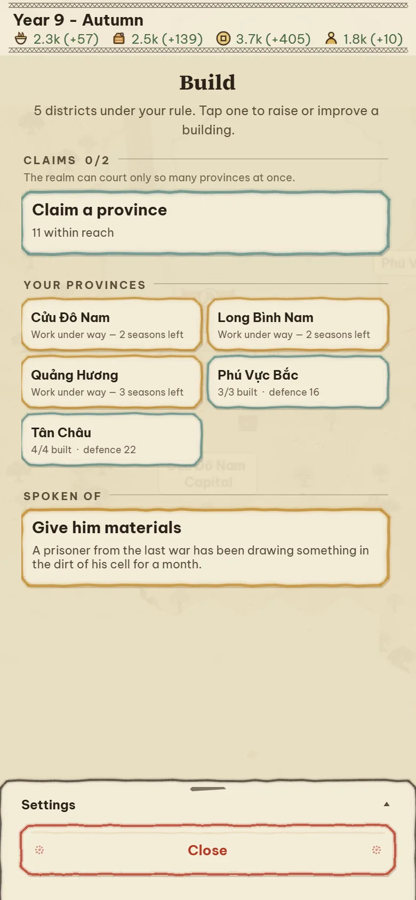
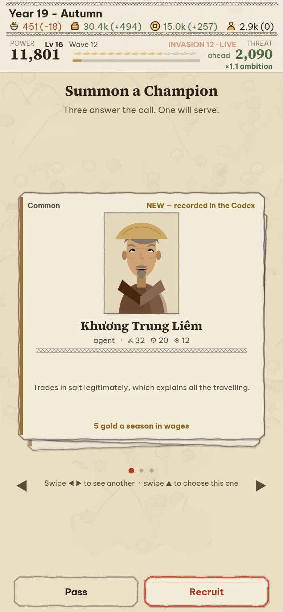
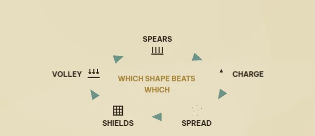
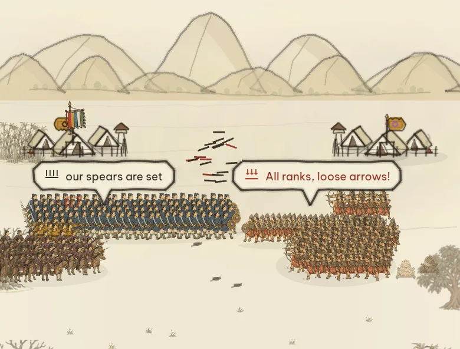
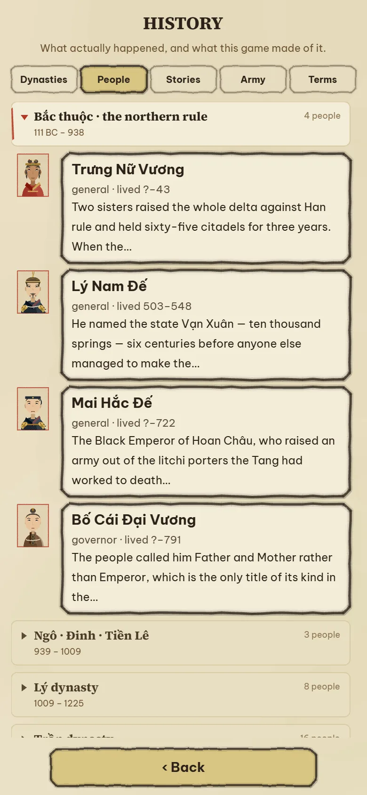
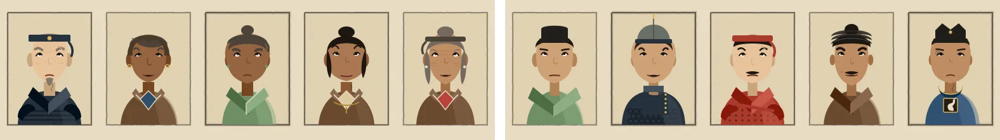
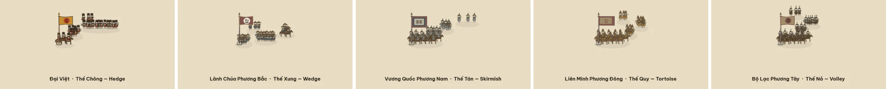

<div align="center">


# Vạn Thắng

### *Ten Thousand Victories*

### Lịch sử Việt Nam, cầm điện thoại một tay là chơi được.

**Game đại chiến lược roguelite, vẽ theo lối tranh khắc gỗ Đông Hồ. Miễn phí, không quảng cáo, tiếng Việt và tiếng Anh song song.**

**[🇬🇧 Read this page in English](README.md)**

[](https://zrg-team.github.io/ten-thousand-victories/)
&nbsp;
[](https://github.com/zrg-team/ten-thousand-victories/actions/workflows/deploy-github-pages.yml)


</div>

---

## 🎯 Vì sao có game này

Người Việt nào lớn lên cũng thuộc mấy chuyện ấy: cậu bé chăn trâu bẻ cờ lau tập trận, sau thành hoàng đế; chiếc nỏ thần và vệt lông ngỗng dẫn đường cho giặc; bãi cọc cắm ngầm dưới lòng sông Bạch Đằng; các bô lão ở điện Diên Hồng cùng hô một tiếng *Đánh!*; chàng thiếu niên đứng ngoài cửa hội nghị, bóp nát quả cam trong tay lúc nào không hay.

Ra khỏi Việt Nam, gần như chẳng ai biết những chuyện đó. Còn ở nhà, chúng hay nằm im trong sách giáo khoa.

**Vạn Thắng** muốn biến kho chuyện ấy thành thứ *chơi được* thật sự: để Yết Kiêu, tấm áo bào của Lê Lai hay Văn Miếu hiện ra thành từng quyết định ngay trên màn hình của bạn — trong một game đủ hay để người ta chơi vì nó hay, chứ không phải vì nó "bổ ích". Game làm cho chiếc điện thoại trong túi bạn, hai thứ tiếng ngang hàng nhau, và không tốn một đồng.

## 🐉 Chơi thế nào — Rồng Thăng Long · *Dragon Ascent*

Bạn là một tiểu vương, có đúng một tòa kinh thành giữa bản đồ bốn mươi hai trấn, lượt nào cũng sinh bản đồ mới. **Giang sơn tự vận hành. Ngươi chọn sức mạnh cho nó.** Thời gian chạy thật: bạn không nhìn thì đất nước vẫn chuyển. Còn mọi lựa chọn thì hiện lên thành lá bài, chạm ngón cái một cái là xong.

- **Giặc đến theo đợt.** Chừng năm rưỡi một đợt, đợt sau đông hơn đợt trước; cứ đợt thứ tư là trùm, báo trước hẳn một mùa. Không có màn thắng — chỉ đếm xem bạn trụ được bao xa.
- **Tham vọng là cái giá.** Chiếm thêm trấn, rút thêm bài, mộ thêm quân — làm gì cũng hun nóng đợt giặc sắp tới. Mở cõi chưa bao giờ miễn phí.
- **Chọn sức mạnh.** Lên cấp là được chọn một trong bốn lá — đồng, bạc, vàng, ngọc — cộng dồn vĩnh viễn. Hai lá đã nâng kịch trần còn *tiến hóa* được thành một lá mới hẳn.
- **Đường lối.** Mỗi thời đại một lần, bạn bảo quần thần giang sơn này là loại giang sơn gì — *Cố Thủ*, *Mở Mang*, *Làm Giàu* hay *Dựng Binh* — rồi bộ máy cứ thế mà xây, tới khi bạn đổi ý.
- **Thua cũng không trắng tay:** cuối lượt, mọi thứ tích vào **Di sản** — mua đặc quyền vĩnh viễn cho lượt sau.

<table>
  <tr>
    <td align="center" width="33%"><br><sub>Giang sơn, giữa một lượt chơi</sub></td>
    <td align="center" width="33%"><br><sub>Ta đánh vào đâu?</sub></td>
    <td align="center" width="33%"><br><sub>Chọn sức mạnh</sub></td>
  </tr>
</table>

Dưới vòng lặp ấy là bốn hệ thống: kinh tế, triều đình, trận mạc, và một cỗ máy kể chuyện. Phần còn lại của trang này kể về chúng — và giải thích vì sao lại làm như thế. *(Ba chế độ cổ điển — Giao Tranh, Ngai Vàng Các Đế Quốc, Chiến dịch — vẫn có đủ; nhưng Rồng Thăng Long mới là món chính.)*

## 🌾 Kinh tế — giang sơn sống bằng gì

<table>
  <tr>
    <td valign="top">

Bốn thứ nuôi giang sơn — **lương thực, vật tư, vàng, nhân khẩu** — chảy ra từ các trấn, mà trấn thì ăn theo chính mảnh đất của nó: ruộng nước với sông thì nuôi người, đồi núi thì rèn giáp, cửa cảng thì buôn bán. Mùa nào thức nấy: vụ thu được ×1,25, mùa đông tụt còn ×0,8. Quân ăn lương, hành quân đốt vật tư, đói quá thì bỏ trốn. Tướng lĩnh bổng lộc từng mùa. Thu vàng quá năm trăm bắt đầu bị thuế lũy thoái ăn dần, kho chất quá bốn nghìn thì của cải bắt đầu thất thoát vì tham nhũng — quân sư sẽ nói thẳng cho bạn biết mùa này kho mục mất bao nhiêu.

**Muốn lái giang sơn thì xây.** Mỗi trấn chứa được vài công trình, và bạn dựng gì thì giang sơn làm được nấy: thành lũy để giữ, ruộng để sống lâu, chợ để có tiền triệu hồi. Xây mất nhiều mùa. Còn hàng "yêu sách" trên đầu màn hình thì ghìm chính chuyện mở cõi: triều đình chỉ ve vãn được chừng ấy trấn một lúc, và *triều đình hỏi bạn trước* — trấn nào trong tầm với sẽ được đặt lên bàn cho bạn gật hay lắc, rồi mới tiêu tiền.

**Vì sao làm thế.** Một roguelite về mở cõi cần một cái phanh, mà phanh không được là đồng hồ đếm ngược — nên kinh tế chính là phanh: mỗi trấn chiếm, mỗi đạo quân mộ đều nuôi Tham vọng, mà Tham vọng thì định cỡ đợt giặc sau. Màn hình xây, nói cho cùng, là cái núm vặn liều. Và mọi con số trên giao diện — tỉ lệ trên lá bài, phần kho mục đi — đều do đúng đoạn mã sẽ phân xử chuyện đó tính ra. Đọc màn hình *chính là* đọc cỗ máy mô phỏng, không phải đọc lời quảng cáo của nó.

</td>
    <td width="38%"></td>
  </tr>
</table>

## 🎎 Danh tướng — một triều đình đáng đồng lương

<table>
  <tr>
    <td width="38%"></td>
    <td valign="top">

Danh tướng đến bằng **triệu hồi** — gacha có bảo hiểm, *ba người ứng mệnh, một người sẽ phò tá* — hoặc do triều đình tiến cử khi Ân sủng đủ đầy. Mỗi người mang sáu chỉ số (võ lược, hậu cần, nội trị, bang giao, trung thành, danh vọng), một khoản bổng lộc mà quốc khố cảm nhận rõ từng mùa, một câu tính cách đáng dừng lại đọc, và một bức chân dung. Gặp ai lần đầu là Codex ghi tên người ấy, mãi mãi.

**Họ làm gì trong game.** Tướng không phải bảng chỉ số nằm trong menu. Họ trấn thủ, đi sứ mệnh, và trên hết là *cầm quân*: có chủ tướng trên trận thì cán cân lệch hẳn, còn đạo quân vô chủ thì đánh đúng kiểu vô chủ. Họ cũng có đời riêng: hai kẻ ghét nhau bỗng ngồi chung mâm, người này xin cầm quân, người kia dứt áo bỏ đi. Và Sử Ký chọn vai cho các câu chuyện từ đúng đám người ấy — vị tướng trong truyền kỳ sắp tới của bạn chính là người bạn đã triệu về, trả lương, và suýt nữa thì để mất.

**Vì sao làm thế.** Thứ lịch sử game này quý là con người, nên mỗi lượt chơi cần một dàn nhân vật để chuyện còn có chỗ mà xảy ra. Gacha cho mỗi lượt một đám bạn đồng hành khác nhau; bổng lộc buộc triều đình vào túi tiền; còn chỉ số khiến câu "ai cầm quân đây?" thành một quyết định thật chứ không phải để làm màu.

</td>
  </tr>
</table>

Chân dung không phải ảnh mua sẵn. Mỗi khuôn mặt ghép từ thư viện **267 bộ phận vẽ tay** — đầu, tóc, mũ mão, cổ áo, y phục, dấu vết — mà chọn bộ nào là do **người đó là ai** (thời nào, chức gì, phẩm hàm nào, nam hay nữ, có lời thề gì) quyết trước, rồi mới tới lượt ngẫu nhiên chọn trong đúng tủ áo ấy. Thế nên quan triều Lê không mặc nhầm cổ áo nhà Nguyễn, tướng ngoài trận không đội mũ nhà nho. Danh sách có 127 danh tướng, phần nhiều là người thật:


## 🥁 Trận mạc — năm thế và một hồi trống

<table>
  <tr>
    <td valign="top">

Trận nào đáng xem là tự nó mở màn: hai bên dàn quân, trống điểm năm nhịp, và từ đó việc của bạn là đọc chiến trường. Đánh nhau trong game này là đánh bằng **năm thế** — năm tư thế một đạo quân có thể đứng: **Chông** rừng giáo cắm chặt, **Xung** mũi dùi, **Tán** tản ra như ong vỡ tổ, **Quy** rùa rút vào mai, **Nỏ** dàn hàng bắn loạt — thế nào cũng khắc hai thế đứng sau nó, xoay tròn:

<div align="center"></div>

Địch tự lộ bài bằng lời hiện trên hàng quân của chúng — *giáo chúng đã cắm*, *chúng chuyển Quy · 3* — việc của bạn là đáp cho trúng. Chồng lên các thế là **núm nhịp độ**, kéo từ *thu quân* tới *dồn ép*: đánh càng rát, quân hao càng nhanh, và cái giá của việc bạn đọc trận đúng hay sai càng nhân lên — tựa đúng thế thì thắng đậm, tựa nhầm thì chảy máu gấp bội. **Dồn sức** là đặt cược thêm một nấc vào chính thế đang giữ; **quân dự bị** tung ra được đúng một lần; kẹt quá thì gọi viện binh; hoặc khoán trắng cho các tướng — họ đánh cũng được, nhưng chẳng bao giờ bằng chính bạn ngồi đó.

**Vì sao làm thế.** Cầm điện thoại một tay thì đừng mơ vi quản từng đơn vị. Nên trận đánh rút lại thành một câu hỏi đọc được — *chúng đang giữ gì, và cái gì trị được nó?* — hỏi dưới sức ép đồng hồ, mọi thứ nhìn rõ từ khoảng cách một sải tay. Và trận không bao giờ tách khỏi lượt chơi: quân là quân do kinh tế của bạn nuôi, chủ tướng là người bạn trả lương, thắng thua thì xoay chuyển đất đai, khí thế, và độ nóng của đợt giặc sau.

</td>
    <td width="38%"></td>
  </tr>
</table>

### Những đạo quân trên chiến trường

Trên chiến trường không có sprite sheet nào cả. Một đạo quân được vẽ thành từng hàng người đứng đúng cái thế nó đang giữ — giáo hai lớp, ngựa dồn ở mũi, khiên khóa vào nhau — dưới quân kỳ của nó, doanh trại sau lưng, bằng đúng thứ mực thủ tục đã vẽ ruộng vẽ thành. Liếc một cái là biết — *bên kia còn đang dàn hàng, bên mình giáo đã cắm xong* — và cái bạn nhìn thấy **chính là** cục diện:



## 📜 Sử Ký — chuyện kể chính là cỗ máy

Chuyện trong game không phải cutscene. Là **bốn mươi tám khuôn truyện**, nằm chờ, gặp đúng thời điểm thì tự gắn mình vào tướng *của bạn*, đất *của bạn* — khi là lời thì thầm trên bản đồ, khi là lá bài trong tay, khi là một đòn xoay cả lượt chơi. Mỗi truyện là một mảnh sử hay truyền thuyết Việt Nam, kể vừa vặn trong quãng thở của một lượt.

<table>
  <tr>
    <td width="40%"></td>
    <td valign="top">

**Vài trang trong số đó**

- *Ngọn Cờ Lau* — Đinh Bộ Lĩnh
- *Nỏ Thần* — và *Lông Ngỗng*
- *Cọc Bạch Đằng*
- *Hội Nghị Diên Hồng*
- *Quả Cam* — Trần Quốc Toản
- *Nam Quốc Sơn Hà*
- *Bình Ngô Đại Cáo*
- *Hai Bà Trưng*, và *Sáu Mươi Lăm Thành*
- *Lê Lai Đổi Áo*
- *Hồ Gươm*
- *Yết Kiêu* · *Ải Chi Lăng* · *Thần Tốc* · *Văn Miếu* · *Thánh Gióng* · *Sơn Tinh Thủy Tinh* …

**Chuyện làm gì trong game.** Một câu chuyện diễn bằng quân cờ thật: vai chính là vị tướng bạn triệu về thật, bối cảnh là trấn đất bạn đang giữ thật, lựa chọn nào cũng tiêu vàng thật, người thật. Ngã ngũ rồi, lá bài nói rõ nó vừa đổi những gì — *−400 tráng đinh, −60 vàng, câu chuyện ngả về một chức chỉ huy*. Có truyện bắt bạn **thề** — giữ một trấn, giữ hòa khí — rồi nhớ dai xem bạn có giữ lời không. Có truyện để lại **dư âm** trong trình duyệt: vị tướng dứt áo bỏ bạn ở lượt này, lượt sau còn có kẻ nhắc tên.

**Vì sao làm thế.** Mấy câu chuyện là lý do cả dự án này tồn tại — nhưng chuyện bấm bỏ qua được thì là cutscene, mà cutscene chẳng dạy được ai. Buộc chuyện vào tướng, vào đất, vào quốc khố của chính lượt chơi thì lịch sử mới thành thứ *xảy đến với bạn*. Và lời kể nào cũng dán nhãn đàng hoàng — *chính sử*: sử sách chép vậy; *dã sử*: dân gian kể vậy; *ngoại truyện*: riêng game này bịa — tất cả đọng vào một cuốn Sử Ký, cuối lượt mở ra đọc lại được.

</td>
  </tr>
</table>

## 🏮 Lịch sử thật, chạm một cái là tới

<table>
  <tr>
    <td valign="top">

Game thì được phép kịch hóa; trang này thì không. **Lịch sử**, cách trang chủ đúng một lần chạm, nói rõ luật của nó: *chuyện thật ra sao, và game đã phóng tác chỗ nào*. Năm thẻ, đủ hai thứ tiếng: các triều đại theo dòng, những con người thật với chân dung và niên đại, từng câu chuyện trong Sử Ký đặt cạnh chính sử, binh chế mỗi thời, và các thuật ngữ người mới hay vấp. Ai tò mò sa vào đây, ngẩng lên là mất một tiếng.

Game cũng tự dạy chính nó: có trang **Cách chơi**, có tour dắt tay lượt đầu, và có dải quân sư đọc ván *đang chơi dở của bạn* rồi mách nước nó sẽ làm gì tiếp — để bức tường số liệu quen thuộc của dòng game chiến lược biến thành lời khuyên của một người cụ thể.

</td>
    <td width="38%"></td>
  </tr>
</table>

## 🖌️ Chuyện vẽ vời

Game gần như không chở theo sprite nào. Người, quân, đất nước — tất cả là nét vẽ thủ tục theo lối **tranh khắc gỗ Đông Hồ**, và dưới đây là chính thứ mực ấy, nhìn thật gần.

### Danh tướng

Mười vị tướng không có trong bất cứ danh sách nào: máy tự bịa ra con người — tên, thời đại, chức phận — rồi tủ áo mặc cho họ theo đúng thân phận, từ chính **267 bộ phận vẽ tay** đã mặc cho các nhân vật thật bên trên. Không có hai triều đình nào giống nhau:



### Quân đội các vương quốc

Quân của vương quốc nào cũng dựng từ một bộ hình người chung — hàng ngũ, quân kỳ đi kèm, doanh trại phía sau — và đứng đúng thế nó đang giữ. Lính để nguyên màu mực là có chủ ý: từng thử nhuộm quân địch theo màu cờ, thế là đội đồn trú nào cũng thành thứ ồn nhất bản đồ — nên phe nào cờ nấy, còn người lính thì cứ là mực. Năm vương quốc trong một lượt chơi, năm thế trận:



### Đông Hồ

Chính bức tranh: giấy điệp quét vỏ sò, bản màu in trước, bản nét mực đen in sau, cố tình lệch nhau một chút như tranh in tay vẫn lệch. Bảng màu là pigment thật — điệp, mực, sỏi son, chàm, gỉ đồng, hoè, nâu — và sắc đỏ rực để dành riêng cho người chơi. Bốn mùa không phải một lớp lọc màu đè lên màn hình: lá đổi màu thật, ruộng ngập nước rồi chín vàng rồi gặt, mùa đông trơ gốc rạ. Cùng một khoảnh đất nước, bốn lần trong năm:


## 📱 Chơi

**[▶ zrg-team.github.io/ten-thousand-victories](https://zrg-team.github.io/ten-thousand-victories/)** — không cần cài, không tài khoản, không gì rời khỏi máy của bạn.

- Làm cho **điện thoại dọc, cầm một tay**; ngồi máy tính chơi chuột cũng ngon lành.
- **Cài được** từ menu trình duyệt, **chơi ngoại tuyến** được — service worker tự viết, không app store nào đứng giữa bạn và game.
- **Kéo** để dời bản đồ, **+ / −** để thu phóng, **chạm** vào trấn, **chạm** vào lá bài để trả lời.
- **Tiếng Việt / English** đổi trong Thiết lập, cùng chỗ với chất lượng đồ họa và kiểu bản đồ.
- Một ô lưu, nằm ngay trong trình duyệt.

## 🛠️ Phát triển

```bash
corepack enable          # lấy đúng bản Yarn đã ghim
yarn install
yarn dev                 # http://localhost:5179
yarn build               # tsc && vite build + service worker — cổng CI
```

Vite + TypeScript (strict) + Phaser 4. Không backend, không framework nào khác. Nội dung là dữ liệu: quân, tướng, lá bài, chiếu chỉ, trấn đất và toàn bộ câu chuyện nằm dưới `src/data/`; hệ thống là hàm thuần trên một `GameState` duy nhất; và chuỗi chữ nào người chơi nhìn thấy cũng phải có đủ bản Việt lẫn bản Anh — thiếu một bên là game từ chối khởi động luôn.

Không có framework test. Game được chứng minh bằng cách **lái nó trong trình duyệt headless thật**: `test_scripts/` có khoảng 140 harness Playwright, xếp theo câu hỏi chúng trả lời — `verify/` khẳng định, `shot/` chụp ảnh, `perf/` đo, `playtest/` chấm điểm, `diag/` điều tra. Chúng khởi động đủ mọi chế độ, quay kinh tế hàng trăm mùa qua nhiều seed, bấm nút thật, chụp từng màn hình, và chấm xem một bản build *vui* được bao nhiêu trên 100 — trước và sau mỗi lần chỉnh cân bằng.

```bash
node test_scripts/gate/smoke.mjs              # mọi chế độ khởi động, chạy, vẽ hình — ~40 giây
node test_scripts/verify/verify-ascent.mjs      # vòng lặp Rồng Thăng Long từ đầu tới cuối
node test_scripts/playtest/playtest-metrics.mjs   # sáu tiền đề đo được của cái vui, /85
node test_scripts/shot/shot-readme.mjs        # tạo lại mọi bức ảnh trên trang này
```

Repo còn kèm một bộ skill và slash-command cho [Claude Code](https://claude.com/claude-code) (`.claude/`), dạy trợ lý AI về hệ thống mỹ thuật, bản đồ lục giác, luật chơi và quy ước harness — để ai đóng góp cùng trợ lý cũng xuất phát từ chung một vốn hiểu biết với người không dùng.

```
src/
├── data/        nội dung — tướng, lá bài, chiếu chỉ, trấn đất, 48 câu chuyện
├── systems/     luật chơi — nhịp tick, kinh tế, chiến trận, ascent/, empire/, story/
├── state/       GameState, lưu, di sản, codex
├── map/         toán lục giác, sinh bản đồ, địa hình, biên giới, đường sá
├── ui/          bộ vẽ và bảng điều khiển; ui/ink/ là bộ từ vựng nét vẽ Đông Hồ
├── scenes/      Boot → Preload → Menu · Guide · History · Skirmish → Map+UI · Conquest+ConquestUI
└── i18n/        các catalog — vi và en, sát cánh nhau
apps/            vỏ nền tảng; game build một lần, mỗi vỏ tự phục vụ
├── mobile/      Expo — iOS và Android
└── desktop/     Tauri — khung sườn
docs/            tài liệu thiết kế và các trang tra cứu sinh tự động
test_scripts/    các harness Playwright
├── verify/      cổng đạt/trượt
├── shot/        trình chụp màn hình
├── perf/        chi phí vẽ, nướng texture và bộ nhớ
├── playtest/    có vui không — số liệu, phiên chơi, lượt chơi trọn vẹn
├── diag/        các cuộc điều tra một lần
└── gate/        smoke và soát lỗi console
```

## 🤝 Cùng làm game hay hơn

Issue và pull request đều mở cửa. Những thứ quý nhất bạn có thể mang tới, xếp theo thứ tự:

1. **Chơi thử, rồi kể lại chỗ nào làm bạn khựng.** Một tấm ảnh chụp màn hình kèm một câu là quý lắm rồi.
2. **Lịch sử.** Chuyện kể sai, tên viết sai, chi tiết nào đọc mà thấy sượng — cứ mở issue. Chuyện trong game được phép phóng tác, nhưng tuyệt đối không được phép *sai*.
3. **Câu chữ tiếng Việt.** Hai thứ tiếng sinh ra để ngang hàng; chỗ nào tiếng Việt đọc lên thấy mùi văn dịch thì nên viết lại hẳn, đừng vá.
4. **Một câu chuyện mới.** `src/data/stories/countingHouse.ts` là khuôn truyện hoàn chỉnh nhỏ nhất; còn `src/systems/story/effects.ts` là tất cả những gì một câu chuyện được phép làm với thế giới.

Trước khi mở pull request: `yarn build` phải qua, và `node test_scripts/gate/smoke.mjs` nên xanh trên dev server của bạn.

## ☕ Ủng hộ

Game miễn phí, và sẽ mãi miễn phí. Nếu nó cho bạn được một buổi tối vui, mời mình ly cà phê — quét mã bằng điện thoại, hoặc bấm vào link:

<table>
  <tr>
    <td align="center" width="50%">
      <br><br>
      <a href="https://wise.com/pay/me/tand99"><b>Wise · quốc tế</b></a><br>
      <sub>wise.com/pay/me/tand99 · @tand99</sub>
    </td>
    <td align="center" width="50%">
      <br><br>
      <a href="https://me.momo.vn/6OfbtWIOTeIJi5Tw"><b>MoMo · Việt Nam</b></a><br>
      <sub>me.momo.vn · app ngân hàng nào quét cũng được</sub>
    </td>
  </tr>
</table>

Hoặc thả cho repo một ngôi sao — người sau tìm thấy game là nhờ nó đấy.

## 🙏 Tri ân

- Các nghệ nhân làng tranh Đông Hồ, Bắc Ninh — mong màu và nét của game này xứng được phần nào với các cụ.
- Phông chữ: [Be Vietnam Pro](https://fonts.google.com/specimen/Be+Vietnam+Pro) và [Source Serif 4](https://fonts.google.com/specimen/Source+Serif+4), giấy phép SIL Open Font License, tự host để dấu tiếng Việt hiển thị giống nhau trên mọi máy.
- Dựng trên [Phaser 4](https://phaser.io), [Vite](https://vite.dev) và [Playwright](https://playwright.dev).
- Lịch sử là của chung tất cả mọi người; kể sai chỗ nào, lỗi ấy thuộc về riêng tác giả.

<div align="center">
<sub><i>Nam quốc sơn hà Nam đế cư.</i></sub>
</div>
