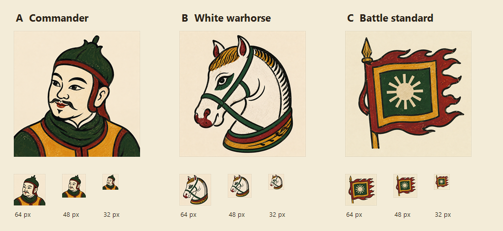
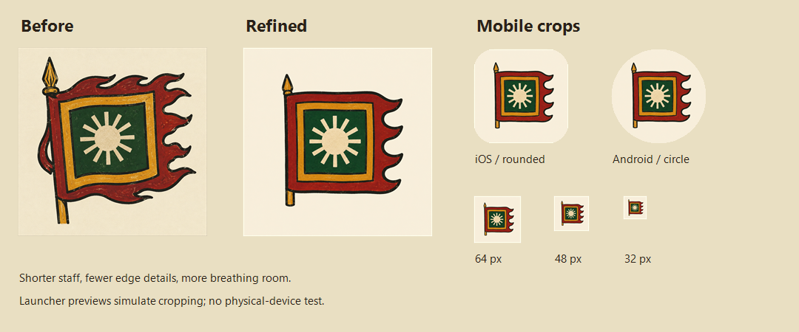

# Đông Hồ icon exploration and mobile selection

Superseded by [v6: combat action](../game-icon-v6/README.md). The user approved this drawing style but rejected the isolated subjects. The battle standard is preserved as design history and is no longer the mobile build source.

6 September 2026 · built-in ImageGen · three candidates, one refined selection.

## Compare

| Direction | Strength | Weakness |
| --- | --- | --- |
| A · Commander | Most human personality; clearly suggests historical characters. | A portrait alone communicates little about commanding a realm. |
| B · White warhorse | Strong folk-print character, particularly the expressive eye and curved outline. | Could suggest a horse game or chess; fine mane marks become busy. |
| C · Battle standard | Clearest relationship to armies and kingdoms; strong contrast at small sizes. | The first version had excessive fringe, a long staff and too much texture. |

**Design recommendation: C, refined.** The selected version shortens the staff, removes the dangling loop and top/bottom fringe, simplifies the outline and adds breathing room. It retains four broad trailing points rather than the three requested in the refinement prompt; this is acceptable in the final visual review because the remaining silhouette is clear. The flag's twelve-ray sun is a stylized game device, not a reproduction of the fourteen-ray Ngọc Lũ drum.

The selected art preserves the references' decisive black contours, flat red/ochre/green blocks, and restrained texture within the colored areas. The generation still added slight tone to the paper despite the uniform-background request. It is visible at large size and unobtrusive in the reviewed launcher crops.

These assessments are design judgments, not user preference testing. The user was invited to choose among the candidates; C was selected based on the assessment while that optional preference was pending.

## Download and provenance

- [Final 1024 px PNG](final-1024.png) · [512 px PNG](final-512.png) · [64 px](final-64.png) · [48 px](final-48.png) · [32 px](final-32.png).
- [Commander master](a-commander-master.png), [horse master](b-warhorse-master.png), [first standard master](c-standard-master.png), [refined standard master](c-standard-refined-master.png).
- [Full candidate prompts](prompts.json), [refinement prompt](refinement-prompt.txt), [detailed critique](critique.md).
- The three images supplied by the user are preserved under `references/`. They establish the requested drawing treatment; they do not authenticate a named person's appearance or a dated uniform. No text from the reference prints is reproduced.
- All creative generation and refinement used the built-in ImageGen tool. Native asset processing only resized and padded the art; no new packages were installed.
- Selected original: `exec-bea16baa-80b1-41bb-b404-b3828fb436bd.png`, copied unchanged to [the mobile source](../../../apps/mobile/branding/dongho-standard-v5.png).

## Mobile integration and validation

The mobile build now exports the selected source to `apps/mobile/assets/icon.png` and `adaptive-icon.png`. The ordinary mobile sync calls this exporter, so future builds retain the selection. Both store icons use the mobile artwork. The web drum and existing splash remain separate.

The 1024 px iOS/app icon is opaque RGB PNG; its store copy matches byte-for-byte. The Play export is 512 px RGBA PNG. The Android foreground contains the paper-backed illustration at 0.66 scale, rather than a transparent cutout. This preserves the generated print, with its border outside the normal launcher viewport. Its matching background color is configured in Expo.

Android's documentation describes a central 66 × 66 safe area within a 108 × 108 layer. The export's darkest/colored subject pixels were checked against the corresponding radius: maximum 0.297, below 0.306. The finial, staff and all flag tips remain inside. [Android adaptive icon guidance](https://developer.android.com/develop/ui/compose/system/icon_design_adaptive).

Checks completed:

- Re-export comparison (`--mobile ... --check`) passed.
- Store-only export and its dimension/color-format assertions passed.
- Expo config resolves to the intended iOS and Android asset paths and paper background.
- iOS/store byte comparison and Android subject-bound checks passed; [machine-readable results](verification.json).
- 32, 48 and 64 px views, rounded iOS-like mask and circular Android viewport were visually inspected.
- Changed source scripts pass syntax and whitespace checks.

The crop previews are simulations. No physical-phone test or native app release was performed; installed phones receive the icon through a new native build.
