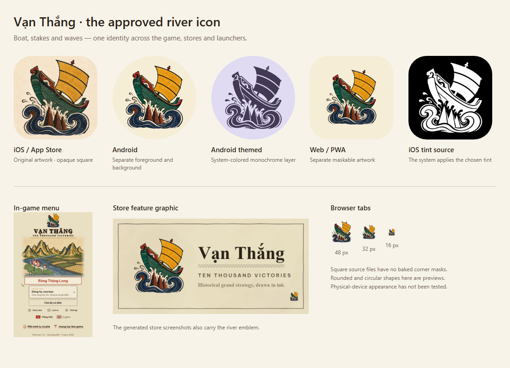

# Approved river icon — all app surfaces

6 September 2026. The user selected the boat-and-stakes concept and requested it throughout the app. The supplied image is preserved byte-for-byte as the production master at `apps/mobile/branding/dongho-river-v7.png`, which `test_scripts/verify/verify-river-icons.mjs` pins by SHA-256.



[Browse the pack](icon-pack/) · [Verification](verification.json)

The pack keeps the Android and iOS resources a gate reads. Its `web/` and `sources/` copies, the zip and the
standalone preview were byte-for-byte duplicates of `public/` and `apps/mobile/branding/`, so they are not
committed; `node scripts/icons/package-river-icons.mjs` regenerates them on demand.

| Surface | Updated assets |
|---|---|
| Game menu | Transparent river emblem, loaded before the menu and uniformly scaled above the title |
| Loading | Matching web and native splash emblems |
| Store materials | Both icons, feature graphic, all 19 screenshot frames, regenerated metadata/config and submission notes |
| Android | Transparent foreground, monochrome themed layer, cream background, five density families and adaptive XML |
| iOS | Opaque 1024 px default and grayscale tint source, universal AppIcon asset catalog |
| Web | 16/32/48/96 favicons, multi-size ICO, 180 Apple touch icon, 192/512 PWA icons and separate maskable variants |
| Social preview | Regenerated share card using the river emblem |

The existing SVG URLs contain the new raster artwork for compatibility. They are not vector redraws; the HTML and manifest use PNG/ICO directly.

Browser favicons now use this same detailed boat's transparent foreground, per the user's follow-up. See the [transparent favicon review](../game-icon-v9/README.md). The updated pack includes fresh versioned browser URLs; installed PWA icons retain their opaque backgrounds.

## Standards checked

- **Android:** separate foreground/background and monochrome layers; significant pixels inside the central 66/108 safe circle. Exported radii are 0.3025 and 0.3030, below 33/108 ≈ 0.3056. [Android adaptive icon documentation](https://developer.android.com/develop/ui/compose/system/icon_design_adaptive).
- **Play:** 512×512, 32-bit PNG, sRGB, under 1024 KB, without baked corner masks or outer shadows. [Google Play specifications](https://developer.android.com/distribute/google-play/resources/icon-design-specifications).
- **iOS:** exactly square 1024×1024 default PNG with no alpha channel; the system applies the corner mask. Uses the supported PNG asset-catalog workflow with an additional tint source. No custom dark appearance or Icon Composer Liquid Glass file is supplied. [Expo integration guidance](https://docs.expo.dev/develop/user-interface/splash-screen-and-app-icon/), [Apple app-icon guidance](https://developer.apple.com/design/human-interface-guidelines/app-icons).
- **Web:** separate `any` and `maskable` entries, relative URLs for repository hosting, opaque maskable backgrounds and artwork within the 80% safe circle. [MDN icon guidance](https://developer.mozilla.org/en-US/docs/Web/Progressive_web_apps/How_to/Define_app_icons), [PWA installability](https://developer.mozilla.org/en-US/docs/Web/Progressive_web_apps/Guides/Making_PWAs_installable).

Android bounds exclude edge pixels below alpha 17. Exact measurements and thresholds appear in the verification report.

## Verification

The game-development client loaded the game; its latest screenshot and state confirmed the new menu. No console-error file was produced. All 24 existing menu fit combinations passed across three themes, both languages and four phone-height/quality combinations.

PNG dimensions, color types, sRGB, real alpha, safe areas, ICO payloads and manifest/config links passed. The installed Expo exporters produced and validated five native Android density families and two iOS appearances in an isolated directory.

TypeScript, the production web build and mobile shell build passed; the service worker and mobile web archive were refreshed. The Yarn shortcut could not locate its `tsc` shim, so the same installed compiler and Vite scripts were invoked directly. No packages were installed. Store feature art, a screenshot frame and the combined platform preview were visually inspected.

No native APK/IPA build, physical-device install, store upload or web deployment was performed. Masks in the preview are approximations, not device screenshots.

## Regeneration

```sh
node scripts/build-icon.mjs
node scripts/build-icon.mjs --mobile apps/mobile/assets
node scripts/build-icon.mjs --check
node scripts/build-icon.mjs --mobile apps/mobile/assets --check
node scripts/build-store-kit.mjs
node scripts/build-share.mjs
node scripts/icons/package-river-icons.mjs
node test_scripts/verify/verify-river-icons.mjs
node scripts/icons/review-river-icons.mjs
```

## Provenance

Built-in ImageGen generated the platform derivatives. [Main prompts](prompts.json), [unsuccessful alpha correction](monochrome-alpha-fix-prompt.txt), [successful monochrome prompt](monochrome-final-prompt.txt).

The first two white-mask attempts had baked checkerboards and were excluded. The final color and monochrome layers have real alpha. These derivatives preserve the subject/style but are not pixel-identical extractions. Main app/store and regular PWA icons are size exports from the unchanged approved master; browser favicons now export the existing transparent foreground.

Original generation filenames:
- Foreground: `exec-e4f96950-d188-42d1-969d-d61b0c6cef2c.png`.
- Rejected white mask: `exec-d4517d76-8c87-44d5-9f8a-62e18a779584.png`.
- Rejected alpha correction: `exec-44d4b0a7-4c16-4a4f-857c-f4548515a800.png`.
- Final monochrome: `exec-6468c850-c22a-45b6-ac85-614eccba7e1f.png`.
