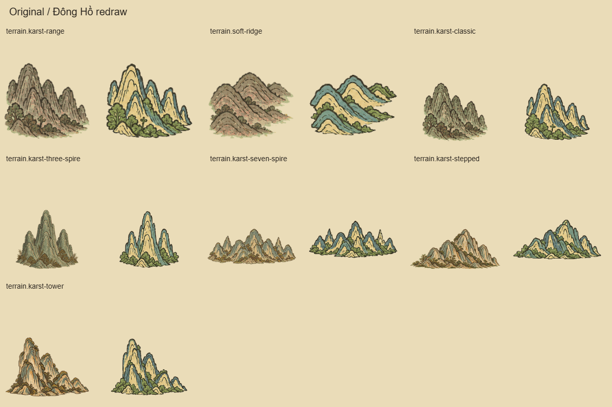
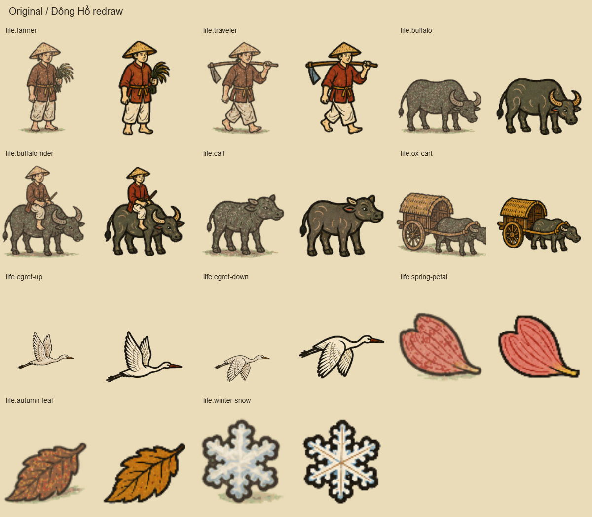
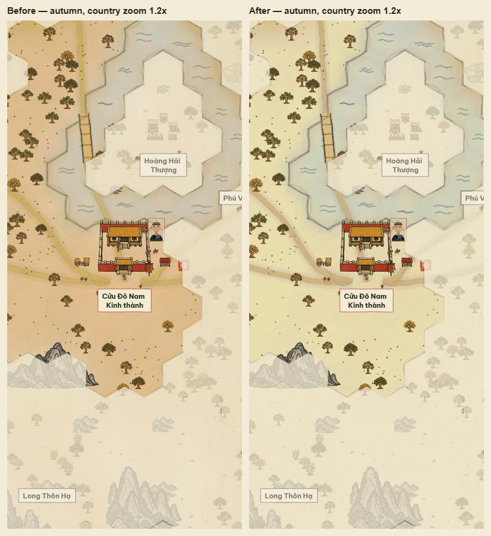
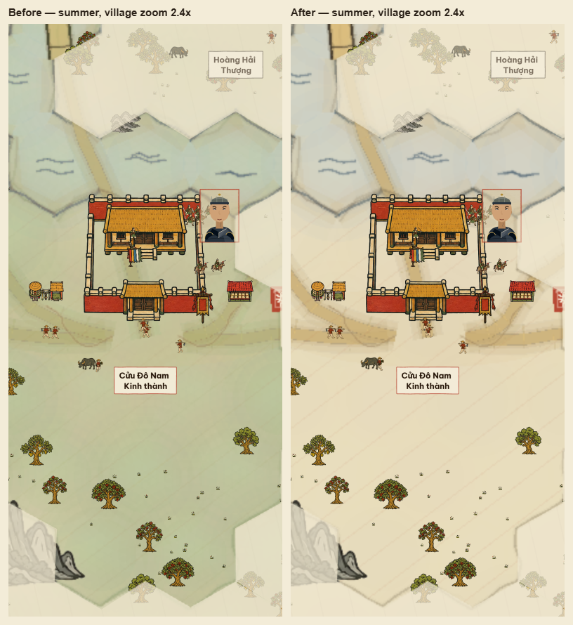
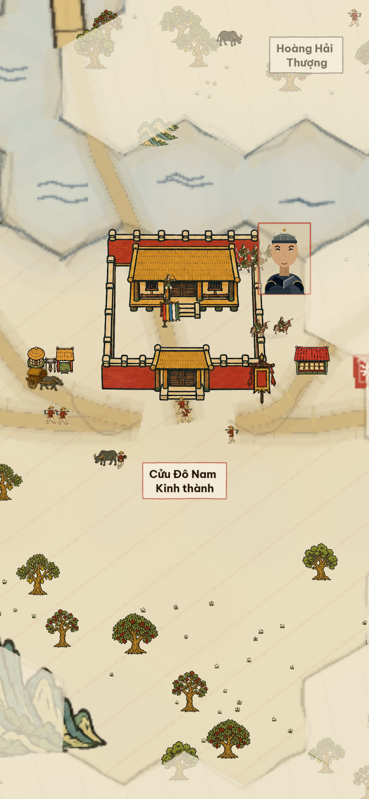

# Đông Hồ map assets — completed

Updated 6 September 2026. **All 91 required map assets and walking sheets are active.** Together with the [234 soldier and structure entries](dong-ho-soldiers-buildings.md), the shared registry selects **325 approved assets**, with no pending replacements in these families.

The map uses broad flat pigment, warm-black contours and sparse curved marks to match the approved soldiers, buildings and decision prints. Mountains use three restrained but visible colours: pale ochre limestone, soft moss green and muted blue-green rock faces. Villagers have simpler expressive faces; buffalo have broad dark bodies and clear horns. Tree species, mountain silhouettes, crop stages, carried tools and historical wardrobe remain distinguishable. This is a game adaptation of Đông Hồ visual language.

### Mountain colour revision — 6 September 2026

At the user's request, all seven mountain and ridge variants were regenerated with built-in ImageGen. The first muted edit was too close to black and white and was superseded. The current version uses pale warm ochre limestone, moss-green vegetation and subdued blue-green indigo rock faces. The colours remain visibly distinct in flat Đông Hồ pigment blocks, with no red/orange bands or global greyscale wash. Existing silhouettes, dark contours and carved curves remain. Seasonal colour influence stays at 12% so weather does not overwhelm the base colours.

The current assets are in `public/art/conquest-dongho-v4/terrain/`; the current master is `output/dongho-map-v4/masters/mountains.png`. [Current edit prompt and provenance](dong-ho-mountain-natural-colour-edit.json). The earlier colourful master and seven exports are retained under `output/dongho-map-v4/masters/mountains-before-muted-palette.png` and `output/dongho-map-v4/mountain-palette-before/`. The rejected grey version is retained as `mountains-grey-rejected.png` beside the master, with its runtime exports under `output/dongho-map-v4/mountain-grey-rejected/`.

The exporter preserves the enclosed grey stone pigment when removing a neutral production background. All 91 map PNG checks and 325 live asset-load checks pass; natural terrain and seasonal checks pass 18/18. Paper/dark cutouts and actual seasonal gameplay were reviewed. Production build passes with the existing font and bundle warnings.

### Ground colour revision — 6 September 2026

At the user's request, the code-drawn ground under the authored assets was re-pitched to the sheet of a print rather than a seasonal wash. A Đông Hồ ground is the điệp sheet, coloured, when it is coloured at all, as one flat tone across the whole sheet; gradation within a colour is the Hàng Trống hand-tinting technique, not a woodblock one. Measured on the medium-quality captures before the change, the owned ground in summer and autumn had sunk to 70% lightness (`#bbcc99` grey-sage and `#ddbb88` tan), the same value as the limestone highlights and the exact hue of the roof ochre, while the ground of the reference prints sits at 83–90%.

Every change is derived from existing pigments. A new `diepWarm` sheet tone (điệp three tenths toward hoa hòe, the "vàng cái" ground) replaces lá tràm as the fill under open ground and cropland in every season. The plains' lean on the canopy dropped from a quarter to a twelfth, and the forest floor now shades toward nâu instead of leaf green. The summer and autumn ground casts fell from 0.14/0.15 to 0.05/0.06, and the cropland cast from 0.55 to 0.4 of the paddy alpha. After the change the owned ground measures `#eeddbb` (83%) in spring, summer and winter and `#eeddaa` (80%) in autumn, and the owned/foreign edge is a value step rather than a hue step. The ground is still drawn as overlapping soft tones; printing it as flat torn-edge blocks, with the water and the ownership hatching treated the same way, is a separate treatment change not made here.

Verification: TypeScript and the production Vite/service-worker build pass, with the existing font and bundle warnings; natural terrain/marker/season checks 18/18; all sixteen seasonal captures were re-shot at medium quality with no browser errors and inspected, along with the autumn menu diorama. The captures embedded elsewhere on this page predate the revision and keep the earlier ground.

## Coverage

| Family | Active entries | Included |
|---|---:|---|
| Seasonal foliage | 40 | Ten plant types in spring, summer, autumn and winter: five tree species, grass, bamboo, banana, areca and banyan |
| Mountains and ridges | 7 | Broad range, low ridge and five distinct karst formations |
| Rice fields and bridge | 6 | Flooded, fallow, transplanted, ripe and nursery compounds; timber bridge |
| Village life and seasonal accents | 11 | Farmer, traveller, buffalo, rider, calf, cart, two egret wing poses, petal, leaf and snow |
| Flags and markers | 23 | Existing faction standards, progress glyphs, rings and map accents |
| Walking sheets | 4 | Four poses each for farmer, traveller, buffalo and cart |
| **Total** | **91** | **All exported, reviewed and selected** |

[Spring foliage](dong-ho-map-style/flora-spring.png) · [Winter foliage](dong-ho-map-style/flora-winter.png) · [Fields and bridge](dong-ho-map-style/fields-bridge.png) · [Farmer walking poses](dong-ho-map-style/walk-farmer-dark.png) · [Cart walking poses](dong-ho-map-style/walk-ox-cart-dark.png)

## Integration

The four walking sheets retain the original four-frame order and world-scale movement. Mechanical export aligns each pose to a common ground line and measured anchor. Existing pause and movement timing is retained; walking people and animals change foot/hoof poses and face their travel direction.

All generated backgrounds were removed mechanically, including gaps between cart spokes, under arms and inside the sun ring. Cream clothing, bird bodies and snow retain their pigment. Complete connected silhouettes are extracted before fitting, preserving fronds, horns and poles that cross nominal sheet cells. Final PNGs have real transparency and empty borders. The exporter does not paint, recolour or invent poses.

Code-drawn low shrubs now use flat foliage and a few leaf marks. Roads use an ochre band with a restrained ink edge; bridges use ochre planks and warm-black rails; water uses sparse curved indigo marks. Continuous ground colouring still joins neighbouring tiles.

The review caught blurred trees caused by the terrain cache. Medium/high settings now draw nearby authored foliage, relief and structures directly, preserving their source contours. Offscreen images are culled and restored when panning. Low quality and cheaper adaptive settings keep their existing cache. Plants and mountains sort by their measured ink base so a changed transparent margin cannot put them on the wrong side of a building. Flat terrain and fog remain cached.

[Autumn overview](dong-ho-map-style/autumn-country.png). Map inspection captures hide the opening founder interface but retain actual ownership haze, labels and world rendering; foreign territory is deliberately pale.

## Saved files and prompts

- Runtime assets and review status: `public/art/conquest-dongho-v4/`, including `map-manifest.json`.
- Shared selection: `src/ui/conquestDongHoV4Assets.json`; walking frame metadata: `src/ui/conquestDongHoV4Walks.json`.
- [Normalized production prompts](dong-ho-map-v4-prompts.json) and [exact prompts, references and generated-file provenance](dong-ho-map-v4-generation-log.json).
- Masters and original reference boards: `output/dongho-map-v4/masters/` and `output/dongho-map-v4/references/`.
- Full paper/dark comparisons: `output/dongho-map-v4/review/`; actual seasonal map captures and state: `output/dongho-map-v4/game/`.
- Mechanical preparation/export/review tool: `scripts/conquest-art/dongho-map-pack.mjs`.

All thirteen map master sheets were generated with **built-in ImageGen**. No API generation was used. The separate successful [Đinh armour repair](dong-ho-dinh-armour-repair.json) completed the previously pending soldier entries.

## Verification

- All **91 map exports** pass dimensions, transparency, clear-border, nonempty silhouette and production-matte checks. Sun-ring and coin centres are transparent.
- The live loader selects and loads **321 accepted still assets plus four walking sheets**, all from v4; all four poses and frame metadata match.
- Walking-sheet checks **17/17**; real movement checks **22/22**, covering direction, four poses, readable human scale and intended body motion, including the traveller's no-bob constraint.
- Natural terrain/marker checks **18/18**, including tree/mountain variants, seasonal tints, mountain-scale limits, paddy placement and badge footprints.
- Ground order **5/5**. All 165 tested relief images and 6,847 scatter images now sort at their exact measured ink base.
- Low/medium/high cache and culling checks pass. On the sampled medium view, 1,133 of 5,670 landscape images are live; all disappear offscreen and restore on return. Vector buffers are not drawn twice.
- Missing and corrupt responses both recover for settlement art and all 91 map assets. Fallback screenshots were inspected.
- Repaired Đinh/Song map and battle animation checks **13/13**; soldier/structure export and runtime audit **234/234**.
- Production TypeScript, Vite and service-worker builds pass. The versioned map art remains optional for offline installation. Existing font stylesheet and large-bundle warnings remain.
- The required game client screenshot and text state were inspected, along with map views across all four seasons at 1.2× and 2.4× and field views at 1.8×. Successful-load browser error logs are empty.

No physical-phone performance measurement or whole-game rescore is claimed. Close-zoom ground/fog caching, enlarged History sprites, portraits and menu art remain separate presentation considerations; the requested soldier, building and map asset coverage is complete.
