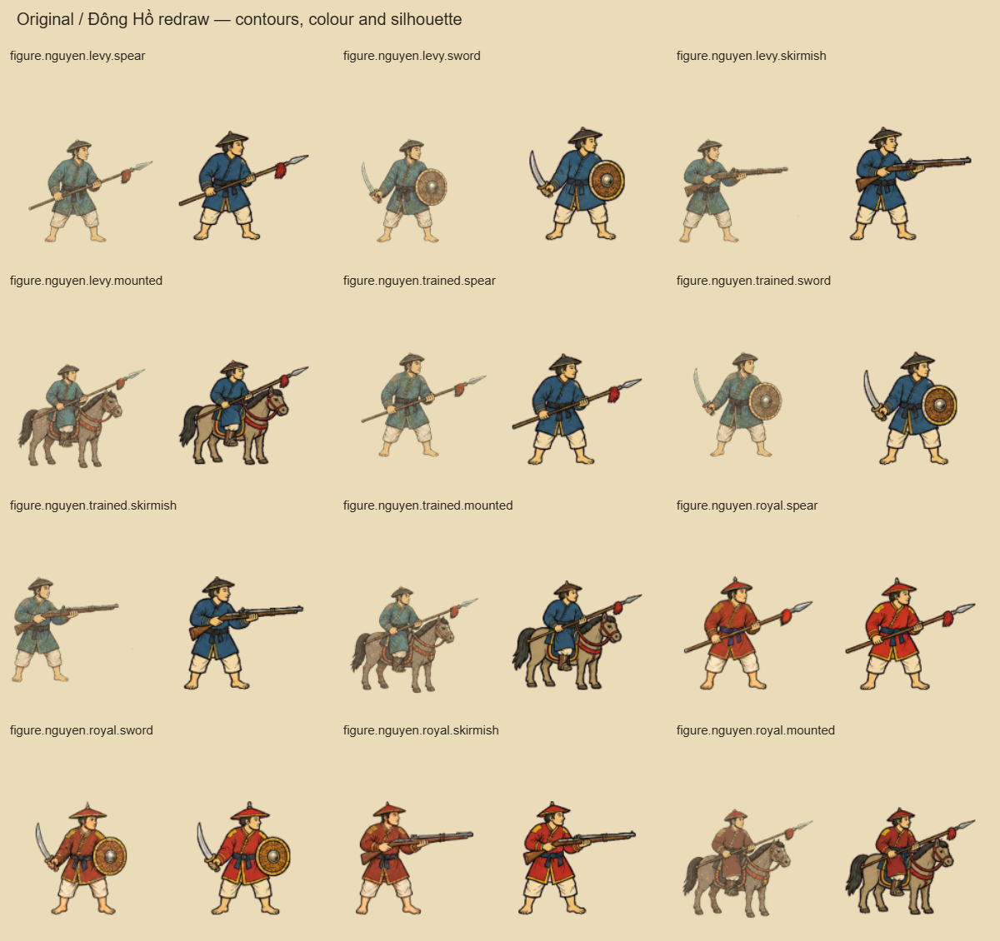
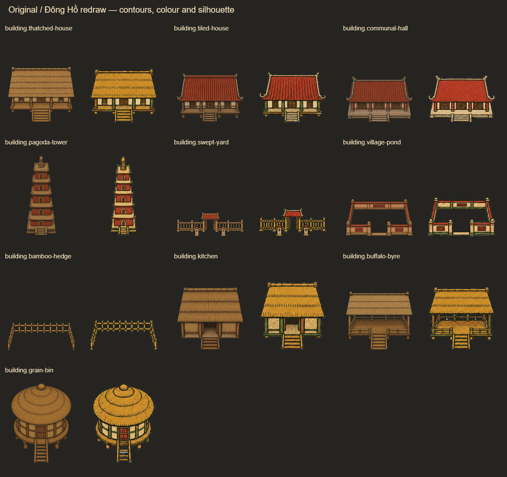
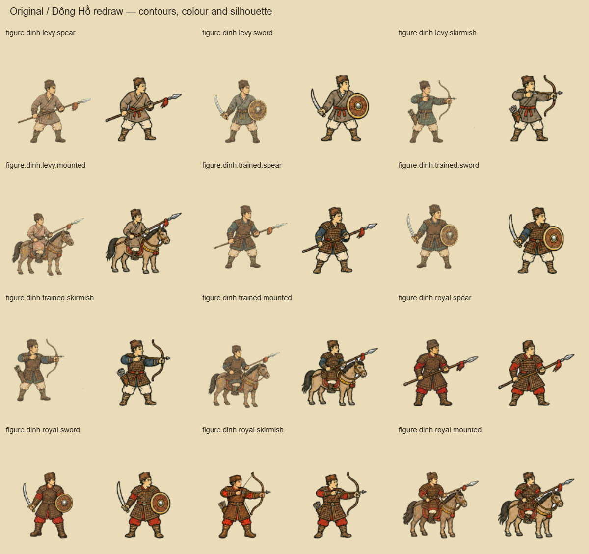

# Đông Hồ soldiers and buildings — completed rollout

Updated 6 September 2026. **All 234 required runtime entries now use approved drawings: 195 soldier slots, 11 settlements and 28 buildings. The Đinh trained armour repair is accepted and active.** The [map continuation](dong-ho-map-style.md) completes the landscape and village-life families as well.

The direction uses stronger warm-black contours, broad opaque vermilion/ochre/indigo/green shapes, simpler faces and roof patterns, and less engraved surface detail. These are game adaptations of Đông Hồ drawing language. The existing era-specific hats, weapons, armour coverage and architecture remain the reference for each redraw.

[Live map close-up](dong-ho-soldiers-buildings/map-close.png) · [Lê–Ming battle](dong-ho-soldiers-buildings/battle-le-ming.png) · [Nguyễn History page](dong-ho-soldiers-buildings/history-nguyen.png) · [Lý comparison](dong-ho-soldiers-buildings/army-ly.png) · [Rural settlement comparison](dong-ho-soldiers-buildings/settlements-rural.png)

## Coverage

| Family | New active entries | Required | Status |
|---|---:|---:|---|
| Đinh soldiers | 15 | 15 | All active; trained armour repaired |
| Lý and Trần soldiers | 30 | 30 | All ranks and weapon slots active |
| Lê, Trịnh, Nguyễn Lords, Tây Sơn, Nguyễn | 75 | 75 | All active |
| Song, Yuan, Ming, Qing, Champa | 75 | 75 | All active |
| Rural settlements | 6 | 6 | All active |
| Citadels | 5 | 5 | All active |
| Buildings and improvements | 28 | 28 | All active |
| **Total** | **234** | **234** | **Complete** |

The completed 195 soldier entries represent 156 distinct drawings plus 39 ranged aliases. Each rank's `bow` slot intentionally aliases its `skirmish` drawing; the redraw preserves the original ranged weapon, including firearms.

The initial Đinh trained redraw removed protective chest armour and was withheld. A successful targeted edit restored the chest, shoulder and skirt protection in all four trained drawings. The repaired sheet was inspected before the five associated slots were activated. [Repair prompt and provenance](dong-ho-dinh-armour-repair.json).

## Saved assets and provenance

- Runtime PNGs and review metadata: `public/art/conquest-dongho-v4/` — 234 approved soldier/structure exports.
- Shared selection map: `src/ui/conquestDongHoV4Assets.json`, consumed by `conquestMapArt.ts`. Map, battlefield and History use the same texture keys and selected paths.
- Reviewed masters: `output/dongho-style-v4/masters/`.
- Original-object reference sheets: `output/dongho-style-v4/references/`.
- Original/redraw comparisons on paper and dark backgrounds: `output/dongho-style-v4/review/`.
- [Normalized production prompts for all 18 sheets](dong-ho-style-v4-prompts.json).
- [Earlier continuation prompts and provenance](dong-ho-style-v4-generation-log.json), retaining the historical failed repair attempt; [successful final repair](dong-ho-dinh-armour-repair.json).

All drawings were produced with **built-in ImageGen**. Earlier usage limits delayed the Đinh repair; generation subsequently succeeded on 6 September. No CLI/API generation or automatic retry was used.

Earlier master provenance, under the thread's Codex generated-images directory:

| Master | Generated file |
|---|---|
| Đinh | `exec-c7699143-bbac-4473-aef1-b3af2d2dbc01.png` |
| Lý | `exec-aeff4314-cd68-4bff-8341-083f27a597c7.png` |
| Trần | `exec-d13e3784-89ec-402a-b7a9-997fe2e7b1c7.png` |
| Citadels | `exec-0d66eb11-2194-4c0d-a1d2-1b7f32717ac9.png` |
| Rural settlements | `exec-4fbb5e7e-1710-4d2a-a26f-af617117bcbe.png` |

## Integration and cleanup

Some generated sheets contained opaque checker or magenta production backgrounds. The exporter mechanically extracts that matte and complete connected silhouettes. Structure extraction now clears small enclosed fence and stair gaps as well as large courtyards; soldier extraction retains small metal highlights. Dark-background review confirms the cleaned building gaps. The exporter does not redraw or recolour the subjects.

Final PNGs have real alpha and empty edge margins. Figures retain the existing 144×128 animation canvas. Structures retain their aspect ratio and semantic world size, preserving layout footprints.

Medium and high quality now draw nearby authored structures, foliage and relief directly to preserve contours at close zoom. They share the same ground order so foreground mountains and trees occlude buildings correctly. Expensive procedural path buffers stay cached on medium. Low quality and cheaper bake settings retain caching. Culling refreshes after rebakes and when panning.

The service-worker builder now recognizes versioned conquest-art directories as optional art, just like the original pack. A missing sprite can use the procedural fallback without blocking offline shell installation.

## Review and verification

- All **234 exports** pass clear-border, transparency, nonempty silhouette, magenta-residue and expected figure-size checks. Ranged aliases are identical.
- All **234 runtime textures** load, with **234 approved v4 paths** selected and zero pending IDs in `output/dongho-style-v4/verification.json`.
- **11/11 settlement layouts** pass with ten improvements each. The live map has zero overlaps among 42 labels and 35 measured structures.
- **13/13 map and battle animation checks** pass using the repaired Đinh and new Song sprites, including standing still, four moving poses, mounted hooves, opposing facing and post-casualty rebuilding. Earlier Nguyễn/Qing checks also passed.
- **9/9 History checks** pass across all 105 supported wardrobe/weapon/rank plates and 35 formations, including title/caption clearance.
- **5/5 ground-order checks** pass at high quality. The test now uses the actual graphics-setting key.
- Missing and corrupt settlement images both recover through procedural fallback.
- Low/medium/high structure checks pass: low caches all 34 sampled structures; medium/high keep them live with nine nearby visible. Pan-away/return culling and absence of duplicated vector ink pass.
- TypeScript, production Vite and service-worker builds pass. All 234 v4 PNGs and their manifest are in the optional-art list, with none in the critical shell. Existing font-at-runtime and large-bundle warnings remain.
- Required game-client screenshot and text state were inspected. Actual medium-quality map views at 1.2×/2.4×, all seven supported History wardrobes, and a Lê/Ming battle were captured. The battle capture restores the scene clock after the still-map setup and waits for real line movement. Browser error logs are empty.

Gameplay evidence is under `output/dongho-style-v4/game/`; the required client output is under `output/web-game/dongho-full-pass-client/`. Map inspection shots hide the opening founder sheet; History and battle shots retain their UI.

## Completion and limits

All **195 soldier slots, 11 settlements and 28 accepted buildings** use approved drawings. The existing catalog rejects `building.mine-worker`; it is excluded from these totals. The [map pack](dong-ho-map-style.md) adds all 91 required map assets and walking sheets to the same drawing family.

The enlarged History page still scales a 144×128 soldier asset, and dense battle formations hide some weapon silhouettes. Principal portraits remain a separate art system. These are presentation limits beyond the completed asset rollout; no full-game rescore or physical-device performance claim is made here.
