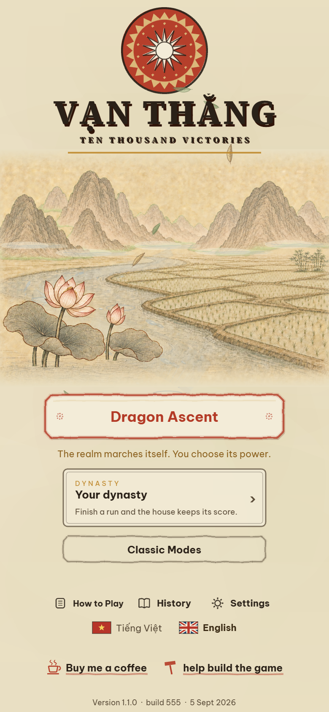
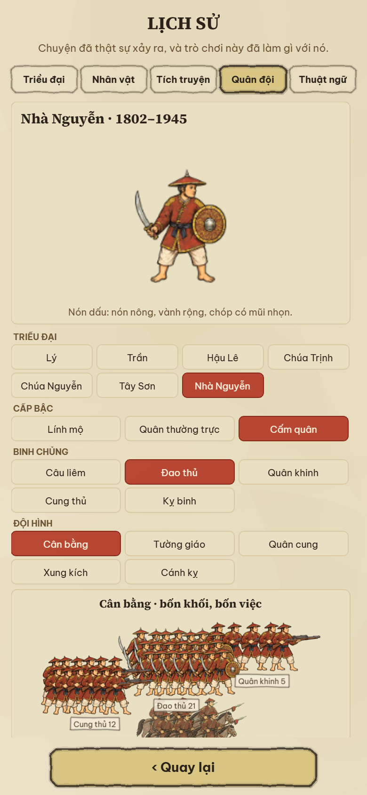
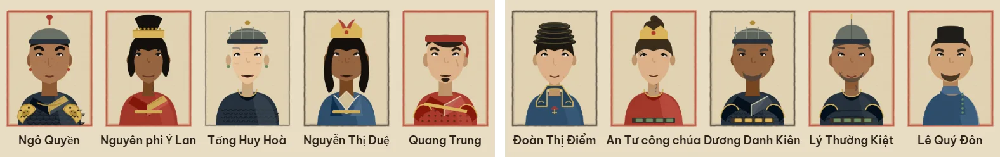
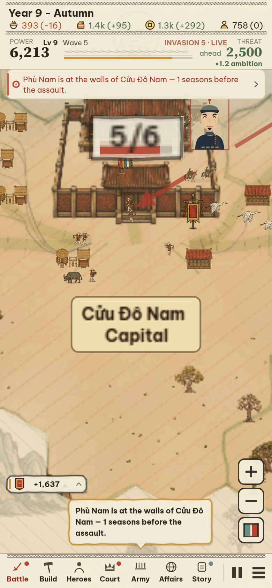
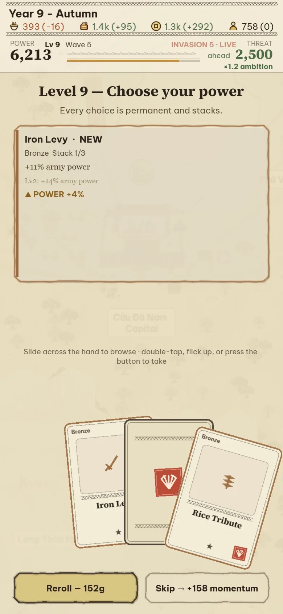
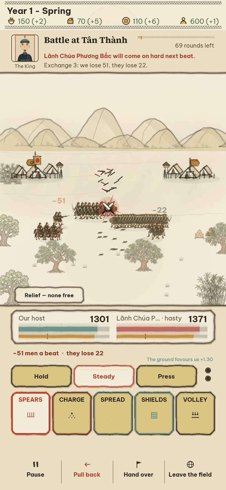

# Vạn Thắng — graphics review, 5 September 2026

**Overall: 6/10.** A distinctive Vietnamese setting with attractive landscape ingredients, held back by inconsistent drawing styles, weak portraits, uneven sharpness, and an interface that often dominates the pictures.

From a player's perspective, the setting would make me try the game. The scenery would give me a positive first impression. I would not yet choose or recommend it on the strength of its graphics alone. The visual direction is worth developing; the current execution does not consistently deliver its promise.

These are subjective art-direction scores, not audience research or a measurement of historical accuracy. A 5 means functional but visibly rough, 7 means attractive and substantially coherent, and 9 means exceptional execution throughout the experience.

| Area | Score | Reason |
|---|---:|---|
| First impression and identity | 7.5/10 | Strong title, seal, lotus, rice landscape, and warm paper. |
| Đông Hồ expression | 6/10 | Pigment restraint and print references are present; much of the art reads as fine engraved landscape illustration or modern vector avatars. |
| Environment and settlements | 7/10 | Appealing architecture and natural motifs; repeated scatter, ground hatching, and mixed sharpness weaken the assembled map. |
| Hero portraits | 4.5/10 | Similar expressions and frontal bodies; necks, shoulders, and hair often look assembled rather than drawn as one person. |
| Soldiers and battle presentation | 6/10 | Stronger individual figures and distinctive wardrobe; small overlapping ranks and modest visual feedback reduce their impact in play. |
| Interface composition | 5.5/10 | Mostly readable, but heavy repeated frames and text dominate; dramatic decisions receive little illustration. |
| Readability and finish | 5.5/10 | Screen text is generally clear; world labels and art become visibly soft at zoom, and information competes with the focal point. |
| Historical atmosphere | 7/10 | Era selectors, clothing differences, architecture, and biographies help; history is conveyed much more through words than memorable illustrated scenes. |

## What was inspected

The current local development build, whose menu identifies version 1.1.0 / build 555 / 5 September 2026. Fresh captures include the title screen; a progressed Dragon Ascent realm; medium-quality map views at default camera, 0.55×, 1.2× and 2.4×; high-quality map presentation; founder creation; power selection; Build, Heroes, Court, and Army screens; an actual running arena battle and several successive combat frames; seasonal variations; roster and generated portraits; Vietnamese History army pages; and a 1440×900 desktop view.

Capture tools set up repeatable game states and use capture mode. Some views intentionally change camera position or season for comparison. This is a visual audit, not a full campaign playthrough or a real-device performance assessment. The initial promotional battle driver ended its run without an active fight; its `battle.webp` and `armies.webp` are not battle evidence. Battle conclusions use `battle-before-order.png` and `battle-motion-3.png` from a confirmed active arena fight. The pale `battle-live-9s.png` is a held decision state, not evidence that active combat is always faded.

## What works

**The title screen makes a coherent promise.** The red circular emblem, large Vạn Thắng lettering, lotus, winding water, rice fields, and distant mountains create a recognizable mood. The main action is easy to find. The scene is peaceful and inviting, which suits the country-building side of the game.

**The landscape has attractive, specific ingredients.** Karst silhouettes, granaries, tiled roofs, buffalo, small people, birds, and fields make the world feel inhabited. The architecture is much more interesting than generic boxes with resource icons. Preserve these motifs and their warm paper setting.

**The restrained palette provides continuity.** Ochre, muted greens, warm black, red, and pale blue sit comfortably together. Screen typography is generally legible, and the Vietnamese names retain their diacritics in the reviewed screens. Autumn produces an appealing golden map; seasonal variation already contributes atmosphere.

**Soldier wardrobe gives history a visible foothold.** The reviewed Lý and Nguyễn History plates have clearly different headgear, clothing masses, and colors. Their figures are more expressive and materially detailed than the hero portraits. That visible differentiation is valuable even though a graphic review cannot authenticate each reconstruction.

## What most needs improvement

### 1. The portrait system is the weakest art family

The portraits read as modular avatar illustrations. Repeated front-facing shoulders, a narrow upright neck, similar eyes and small smiles, and interchangeable face/hair components make leaders difficult to remember. Some neck-to-collar transitions feel anatomically awkward. A famous commander or court figure does not gain much presence from the current composition.

This criticism is about the drawing, not the people represented. Flat color and simplified anatomy can be excellent folk art. Here, the problem is that the shapes do not consistently form a convincing, expressive whole, and their very clean surfaces clash with the detailed soldier and landscape art.

**Improve:** Establish a few complete portrait compositions with convincing head/neck/shoulder attachment, expressive brows and mouths, deliberate hair silhouettes, visible garment folds, and a shared ink contour. Give principal historical figures authored identities. Use those portraits to constrain the modular system. Check them at actual portrait size before adding more variations.

### 2. Sharpness is inconsistent within the same map

The medium-quality 2.4× view visibly blurs the capital, its name, and the large `5/6` marker while nearby people, a portrait, and other small objects remain comparatively sharp. The progress marker is already soft in the 1.2× high-quality capture. The result looks like an enlarged low-resolution label placed over more carefully drawn art.

The History page also enlarges a soldier into visible softness. Small runtime sprites and large inspection illustrations need different rendering treatment.

**Improve:** Keep map text and status icons crisp at their displayed size, limit their growth with world zoom, and provide suitable illustration resolution for inspection screens. Make important outlines survive the normal medium setting. More source detail alone will not solve inappropriate display scaling.

### 3. Information competes with the capital and the battle

On the reviewed map, the capital is covered by a large fraction badge and crossed by a strong arrow. A portrait, seal, and separate nameplate add more competing focal points. The invasion message appears in a top alert and again in a bottom speech bubble in the same captured state. The resource area, alerts, navigation, and floating controls further narrow the view.

The issue is not simply the amount of information; it is that several unrelated elements have similar visual weight. The player should immediately see where they are, what needs attention, and what action is available.

**Improve:** Give each settlement one compact anchored information group. Reserve the strongest accent for the selected or urgent object. Consolidate duplicated notices. Make detailed statistics appear when selected. Review a busy, threatened realm rather than judging only an empty early map.

### 4. The ground and repeated objects expose the map's construction

Long diagonal hatching crosses broad areas, including settlements. Repeated trees, small structures, and isolated mountain groups can read like stamps scattered across ruled paper. The pale terrain, fog, and background often converge in value, while the decoration still produces many tiny edges.

**Improve:** Arrange planting around meaningful places: village groves, field boundaries, riverbanks, paths, and mountain foothills. Use connected landforms and varied clump size. Reduce broad hatching and reserve it for information that needs encoding. Give water, open country, forest, and mountains a readable shape and value hierarchy before adding interior detail. Symbolic scale is appropriate; a capital should nevertheless have a deliberate relationship to neighboring houses, people, and trees.

### 5. Important choices have little visual storytelling

The power-draft screen places a few lines of statistics inside a very large mostly empty panel; the cards below rely on small generic symbols. Build, Army, and History repeat bordered text blocks. Their information works, but the game spends its most dramatic moments presenting prose in boxes.

The rough outlines and slightly offset print effects support the concept in moderation. Repeating heavy double and triple edges on nearly every control makes the screen visually noisy. The History army selector's simpler filled buttons also reveal a different control vocabulary within the same interface.

**Improve:** Add a modest set of meaningful woodblock vignettes for recruitment, rice collection, court petition, marching, siege, and victory. Put the illustration, short consequence, and choice together. Keep one principal border treatment and make secondary controls quieter. Improve memorable scenes before increasing the total asset count.

### 6. Battles need clearer silhouettes and stronger visual consequences

In active combat the figures do move, arrows appear, casualties change, and impact symbols provide feedback. It would be inaccurate to describe the battle as entirely static. However, tightly repeated figures merge into dark bands. Both sides share much of the same brown/gold value range, and a large part of the fight's meaning is conveyed by narration and numbers.

The battle background uses much simpler mountain and camp drawings than the campaign's detailed karst and settlement illustrations. That shift contributes to the uneven art direction.

**Improve:** Separate infantry, missile troops, and cavalry by silhouette and spacing at phone size. Use banners, positioning, and restrained trim colors to reinforce ownership. Show a readable preparation, strike, and recovery in attack motion; make loss of formation or morale visible. Enlarge the visual focus during a decisive clash. Retain the printed aesthetic while giving each event a clear consequence.

## How well does it express Đông Hồ?

The game has a credible starting vocabulary: paper, limited pigments, ink contours, seals, village subjects, and patterned decoration. UNESCO describes Đông Hồ as hand-produced woodblock prints with natural pigments on scallop-powder-coated paper, with subjects including history, worship, daily life, and landscapes. That supports this game's combination of kingdoms and rural life. [UNESCO's description](https://ich.unesco.org/en/decisions/20.COM/7.A.1)

My visual judgment is that the current game reads more consistently as a Vietnamese illustrated paper strategy game than as a fully unified Đông Hồ interpretation. Fine landscape hatching, small shaded soldier illustrations, modern flat avatars, and thick game-interface frames coexist without a shared drawing discipline.

The next art pass should concentrate on bold readable silhouettes, intentional flat pigment areas, expressive people, selective carved-looking details, and narrative compositions. Controlled print variation can strengthen the finish. A global yellow wash, generic weathering, or extra outlines will not establish the style by themselves. Vivid accents can coexist with paper warmth; an old art tradition does not need to look uniformly faded.

## History as something the player can see

The project's wardrobe research explicitly separates supported forms from interpretation and distinguishes eras. That is a worthwhile foundation; this review did not independently authenticate its individual costume claims. The game should preserve that specificity as its art becomes more expressive.

The larger opportunity is to show history through composition: a recognizably important ruler, a petition in court, a named place, a military preparation, or a civilian consequence. The current interface usually tells the historical story through names and biographies. More authored scenes would make it memorable visually.

## Recommended order of work

1. **Fix visible presentation defects:** crisp map labels and status markers; sensible size limits; coherent settlement annotations; removal of redundant alerts. Success: a player can identify the capital, threat, and selected action immediately at normal phone size, and zoom does not turn critical text into blur.
2. **Define the shared drawing language:** approve one hero, soldier, building, landscape fragment, and interface panel together. Success: they look as if they belong to the same illustrated world at their actual display sizes.
3. **Improve the heroes:** author a small flagship set, then revise the modular portrait parts against it. Success: main figures are memorable without relying on their names.
4. **Improve battle readability and motion:** simplify figure detail where necessary, separate ranks, clarify ownership, and make attacks and retreats visually readable.
5. **Add illustrated historical moments:** prioritize frequent decisions and emotionally important events over more decorative scatter.

Desktop is a secondary consideration if the intended audience is mainly phone users: the reviewed 1440×900 layout leaves broad empty side margins around the portrait game. A larger-screen composition could use that space for map context or persistent information, but it should follow the more visible phone issues above.

The strongest existing assets deserve a more coherent presentation. The largest gain will come from relationships between elements—style, scale, contrast, composition, and motion—rather than simply making every asset more detailed.
